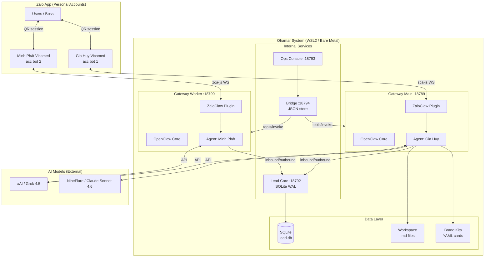

# PROJECT_HANDOFF.md — Ohamar Technical Handoff (Complete Refined v3)

> **Review date:** 2026-07-28T14:42 ICT  
> **Git Branch:** `sync/vps` `[EXEC-VERIFIED]`  
> **Git Commit Hash (Main):** `03ed261718d2a404d5ccdd3702d85d276a68bc3d` `[EXEC-VERIFIED]`  
> **Git Working Tree:** `DIRTY` (21 modified files, 7 untracked entries including bridge/zalocrm) `[EXEC-VERIFIED]`  
> **Git Commit Hash (vendor/zaloclaw):** `afd2306deaff50c955952f71581691cf516dce4e` `[EXEC-VERIFIED]`  
> **Hash Calculation Note:** Calculated via Powershell `Get-FileHash` (SHA-256) on raw file bytes. Note that checking out code with different line endings (CRLF vs LF) will alter byte-level hashes.  
> **Review Taxonomy Legend:**  
> - `[CODE-VERIFIED]` Explicitly verified from source code  
> - `[EXEC-VERIFIED]` Verified by running commands on host  
> - `[INFERRED]` Deducted from code structure or standard patterns  
> - `[DOC-CLAIMED]` Stated in project docs (not independently verified at runtime)  
> - `[UNVERIFIED]` Code/runtime not inspected or partially inspected  

---

# 1. Executive Summary

## Vấn đề giải quyết `[DOC-CLAIMED]`
Ohamar là hệ thống **AI chatbot CSKH + CRM nhẹ** chạy trên **Zalo tài khoản cá nhân** (không phải Zalo OA). Hệ thống cho phép:
- Bot AI tự động trả lời tin nhắn Zalo (DM + nhóm khi được @mention)
- Tư vấn sản phẩm y khoa / thẩm mỹ (pilot: Vicamed)
- Quản lý luồng hội thoại (conversation) với ownership, handoff, consent và outbound authorization
- Supervisor model: bot lead (Gia Huy) quản lý bot worker (Minh Phát) qua file lệnh
- Website monitoring (Vicamed web watch)

## Đối tượng sử dụng `[DOC-CLAIMED]`
- **Boss/Owner** — điều khiển bot qua Zalo chat, slash commands (`/voice`, `/model`, `/go-block`)
- **Khách hàng** — chat với bot qua Zalo để hỏi thông tin sản phẩm, giá, xem case lâm sàng
- **Operator** — quản lý hội thoại qua Ops Console web UI hoặc CRM interface

## Trạng thái hiện tại `[CODE-VERIFIED]`

| Phần | Trạng thái kỹ thuật | Nguồn kiểm chứng |
|------|-------------------|-------------------|
| Chatbot AI (Gia Huy + Minh Phát) | Configured/Implemented; runtime currently stopped | `[CODE-VERIFIED]` |
| Zalo integration (ZaloClaw) | Plugin registered; implementation partially unverified | `[CODE-VERIFIED]` |
| Lead Core (conversation management) | Implemented (Phase 0–1 MVP conversation tracker) | `[CODE-VERIFIED]` |
| Ohamar Bridge (CRM↔Ohamar) | Implemented (Phase 1: send + ai-mode, inbound stub) | `[CODE-VERIFIED]` & `[EXEC-VERIFIED]` |
| Ops Console (web UI) | Implemented (Demo prototype: takeover/inbox) | `[CODE-VERIFIED]` |
| CRM UI (apps/crm-ui) | Reference code present (chưa wire Ohamar) | `[CODE-VERIFIED]` |
| FB Messenger | Scaffold only (chưa implement) | `[CODE-VERIFIED]` |
| Product cards / brand-kits | Present in workspace (Vicamed pilot cards) | `[DOC-CLAIMED]` |

## Đã triển khai theo cấu trúc codebase `[CODE-VERIFIED]`
- Kiến trúc agent 6 tầng (L1–L6) theo [ARCHITECTURE.md](file:///[PROJECT_ROOT]/workspace/ARCHITECTURE.md)
- Behavioral layer: 9 voice modes, medical-sales safety, escalation protocol
- Dual-bot architecture (Gia Huy main + Minh Phát worker)
- Product lookup + case lookup skills (workspace skills)
- Lead Core: conversation lifecycle, ownership, outbound auth, consent, audit
- Ops tooling: health, watchdog, backup, doctor, zalo-login

## Chưa triển khai / Thiếu hụt `[CODE-VERIFIED]`
- Lead Core thiếu: contacts table, deals/pipeline, tags, notes, search/filter API có pagination
- Bridge inbound fan-out chưa implement (mới chỉ ack receipt)
- CRM frontend chưa kết nối với Lead Core API
- FB Messenger adapter chưa implement
- Automated test suite cho services tự viết (`lead-core`, `ohamar-bridge`, `ops-console`)
- CI/CD pipeline và containerization cho core services

---

# 2. Technology Stack `[CODE-VERIFIED]`

| Thành phần | Giá trị | Nguồn |
|-----------|---------|-------|
| **Runtime** | Node.js ≥ 22.19.0 (ES modules) | `[CODE-VERIFIED]` (`package.json`) |
| **Language** | JavaScript (`.mjs`) cho services; TypeScript cho ZaloClaw & CRM UI | `[CODE-VERIFIED]` |
| **Core framework** | OpenClaw (`openclaw` ^2026.7.1) — AI gateway | `[CODE-VERIFIED]` |
| **Channel plugin** | ZaloClaw (`vendor/zaloclaw/`) — Zalo personal via `zca-js` (reverse-engineered) | `[CODE-VERIFIED]` |
| **Database** | SQLite (via native `node:sqlite` / `DatabaseSync`) với WAL mode | `[CODE-VERIFIED]` |
| **ORM** | Không — raw SQL prepared statements | `[CODE-VERIFIED]` |
| **Auth** | Bearer token (single shared token per service) | `[CODE-VERIFIED]` |
| **HTTP server** | `node:http` (native Node HTTP module, no Express/Fastify) | `[CODE-VERIFIED]` |
| **AI Models** | xAI Grok 4.5 (primary), Claude Sonnet 4.6 via NineFlare (thinking) | `[CODE-VERIFIED]` |
| **CRM UI framework** | Vue 3 + Vuetify 4 + Vite 8 + TypeScript (reference, chưa wire) | `[CODE-VERIFIED]` |
| **Build tools** | npm scripts, `node:child_process` spawn | `[CODE-VERIFIED]` |
| **Test framework** | vitest (ZaloClaw + CRM UI only; services chưa có test) | `[CODE-VERIFIED]` |
| **Deploy Target** | WSL2 local / VPS bare metal | `[EXEC-VERIFIED]` |

---

# 3. Repository Structure `[CODE-VERIFIED]`

```
ohamar/
├── bin/
│   └── ohamar.mjs                    # CLI entry: thin wrapper → scripts/
├── scripts/                           # Ops & lifecycle scripts
│   ├── env.mjs                       # ★ Core: instance resolution, paths, env, process locks
│   ├── start.mjs                     # Start gateway with process lock
│   ├── stop.mjs                      # Graceful stop (SIGTERM → SIGKILL)
│   ├── setup.mjs                     # First-time setup (dirs, config, zaloclaw link)
│   ├── health.mjs                    # Health check (config, port, credentials, account)
│   ├── watchdog.mjs                  # Periodic health check → alerts
│   ├── zalo-login.mjs                # QR login / re-login Zalo personal account
│   └── backup.mjs                    # tar.gz backup data/ & data-worker/
├── vendor/
│   └── zaloclaw/                     # ★ ZaloClaw plugin (TypeScript, git repo)
│       ├── src/                      # Plugin source [UNVERIFIED]
│       ├── dist/                     # Compiled JavaScript
│       ├── openclaw.plugin.json      # Plugin manifest (~150 actions)
│       └── tests/                    # vitest unit tests
├── services/
│   ├── lead-core/                    # ★ Conversation & Lead management API
│   │   ├── schema.sql                # SQLite schema (8 tables)
│   │   ├── package.json
│   │   └── src/                      # Full implementation [CODE-VERIFIED]
│   │       ├── server.mjs            # HTTP API server (:18792)
│   │       ├── handlers.mjs          # Core business logic (408 lines)
│   │       ├── db.mjs                # SQLite connection & migration
│   │       ├── config.mjs            # Service configuration & constants
│   │       ├── client.mjs            # Internal HTTP client
│   │       ├── audit.mjs             # Audit event logger
│   │       ├── outbound-gate.mjs     # CLI gate for outbound authorization
│   │       ├── watch.mjs             # Vicamed website content hash watcher
│   │       ├── watch-cron.mjs        # Cron wrapper for watch
│   │       └── doctor.mjs            # Lead Core diagnostic tool
│   ├── ohamar-bridge/                # ★ CRM ↔ Ohamar bridge API [CODE-VERIFIED]
│   │   └── src/
│   │       ├── server.mjs            # HTTP API server (:18794)
│   │       ├── send.mjs              # Outbound message dispatcher (tools/invoke + CLI fallback)
│   │       ├── bots.mjs              # Bot status & credential checker
│   │       └── store.mjs             # JSON file store (ai_modes & event log)
│   ├── ops-console/                  # Ops & sales takeover demo [CODE-VERIFIED server]
│   │   └── src/
│   │       ├── server.mjs            # HTTP server (:18793) & static file server
│   │       ├── handlers.mjs          # Demo takeover handlers [UNVERIFIED]
│   │       └── db.mjs                # Demo store [UNVERIFIED]
│   └── fb-messenger/                 # FB adapter scaffold (chưa implement)
├── apps/
│   ├── crm-ui/                       # Full ZaloCRM frontend reference [UNVERIFIED]
│   └── zalocrm/                      # Full ZaloCRM Docker stack reference [UNVERIFIED]
├── workspace/                        # ★ Agent workspace (persona, rules, skills)
│   ├── SOUL.md                       # Bot personality + 9 voice modes
│   ├── BEHAVIOR.md                   # L3 behavioral rules (reply/refuse/escalate)
│   ├── ARCHITECTURE.md               # L1–L6 system architecture layers
│   ├── ROUTING.md                    # Model routing policy
│   ├── MEDICAL-SALES.md              # Medical sales compliance rules
│   ├── IDENTITY.md                   # Bot identity (Gia Huy)
│   ├── USER.md                       # Boss preferences & voice mode
│   ├── MEMORY.md                     # Long-term memory index
│   ├── SUPERVISOR.md                 # Lead–worker hierarchy rules
│   ├── COMMANDS.md                   # Chat slash commands reference
│   ├── MODELS.md                     # Model aliases & API setup guide
│   ├── TOOLS.md                      # Tool documentation & safety rules
│   ├── STACK.md                      # Workspace structural map
│   ├── brand-kits/                   # Product cards (YAML) [UNVERIFIED]
│   └── skills/                       # 19 workspace custom skills [UNVERIFIED]
├── data/                             # Main bot runtime state (gitignored)
├── data-worker/                      # Worker bot runtime state (gitignored)
├── package.json                      # Root scripts & openclaw dependency
└── README.md                         # Project documentation
```

---

# 4. Architecture `[CODE-VERIFIED]`

## Kiến trúc tổng thể

Ohamar là **branded wrapper** trên OpenClaw (AI gateway) + ZaloClaw (Zalo plugin). Hệ thống không fork OpenClaw mà dùng như npm dependency.

**Mô hình 6 tầng (L1–L6):**

| Tầng | Vai trò | Implementation |
|------|---------|---------------|
| L1 Model | Chọn AI model | `ROUTING.md`, `MODELS.md`, config `agents.defaults.model` |
| L2 Pipeline | Tools + Skills | ZaloClaw actions, workspace skills, exec/files/web tools |
| L3 Behavioral | Khi nào reply/im/từ chối | `BEHAVIOR.md`, `SOUL.md`, `MEDICAL-SALES.md` |
| L4 Memory | Nhớ xuyên session | `MEMORY.md`, `USER.md`, session transcripts JSONL |
| L5 Safety | Auth & Access control | allowlist, pairing, go-block, ownerAllowFrom |
| L6 Observability | Audit & Debugging | Gateway log, transcripts, passive JSONL, audit DB |

## Mermaid Architecture Diagram



## Luồng dữ liệu chính `[CODE-VERIFIED]`

### Inbound (User → Bot)
```
Zalo WS → zca-js → ZaloClaw monitor
  ├─ Prompt injection guard
  ├─ Passive JSONL logger (group history)
  ├─ POST /v1/events (Lead Core — dedup & conversation creation)
  └─ OpenClaw agent pipeline
       ├─ L5: allowlist / pairing check
       ├─ L3: behavioral rules (reply? silent? escalate?)
       ├─ L1: model routing (Grok 4.5 vs NineSonnet)
       ├─ L2: skills/tools execution (product-lookup, case-lookup)
       └─ Response → ZaloClaw send → Zalo WS
```

### Outbound (Bot → User, khi Lead Core enforce)
```
Agent wants to send message
  ├─ POST /v1/conversations/{id}/outbound (caller == owner check)
  ├─ Allowed? → ZaloClaw send → Zalo WS
  └─ Denied (409)? → Block message dispatch, write audit log
```

---

# 5. Entry Points and Runtime Flow `[CODE-VERIFIED]`

## Điểm khởi chạy

| Entry Point | Command | Vai trò |
|-------------|---------|---------|
| `bin/ohamar.mjs` | `node bin/ohamar.mjs <cmd>` | CLI branded wrapper |
| `scripts/start.mjs` | `npm run start` | Start main gateway (port 18789) |
| `scripts/start.mjs` | `npm run start:worker` | Start worker gateway (port 18790) |
| `services/lead-core/src/server.mjs` | `npm run lead-core:start` | Lead Core HTTP API (port 18792) |
| `services/ohamar-bridge/src/server.mjs` | `npm run bridge` | Bridge API (port 18794) |
| `services/ops-console/src/server.mjs` | `npm run ops-console` | Ops Console API (port 18793) |

## Quá trình Bootstrap (Main Gateway) `[CODE-VERIFIED]`
1. `scripts/start.mjs` nạp `scripts/env.mjs`.
2. `env.mjs` resolve `OHAMAR_INSTANCE` (`main` hoặc `worker`) và khởi tạo đường dẫn state/workspace.
3. `assertOpenclawInstalled()` kiểm tra sự tồn tại của openclaw binary.
4. `stripBomFromJsonFile(CONFIG_PATH)` xử lý UTF-8 BOM do Windows editors tự thêm.
5. `relocateOpenclawConfig()` điều chỉnh đường dẫn tương thích giữa Windows và Linux/WSL.
6. `assertCredentialsIsolation()` thực hiện kiểm tra fail-closed: chống symlink escape, chống dùng chéo credentials giữa main và worker.
7. `acquireProcessLock()` tạo file lock độc quyền (`O_EXCL`) và ghi file PID.
8. `ohamarEnv()` xây dựng biến môi trường nạp `OPENCLAW_STATE_DIR`, `OPENCLAW_CONFIG_PATH`, `LEAD_CORE_*`.
9. Spawns `openclaw gateway --port 18789`.
10. Signal handlers bắt SIGINT/SIGTERM → graceful shutdown (15s timeout trước khi SIGKILL).

## Background Jobs `[CODE-VERIFIED]`

| Job | Trigger | File |
|-----|---------|------|
| Vicamed web watch | Cron `0 9,17 * * * Asia/Ho_Chi_Minh` | `services/lead-core/src/watch-cron.mjs` |
| Ops Console auto-resume | `setInterval` 5s | `services/ops-console/src/server.mjs` L213 |
| Watchdog | Continuous loop (default 60s) | `scripts/watchdog.mjs` |

---

# 6. Feature Map `[CODE-VERIFIED]`

## 6.1 Chatbot CSKH (AI Agent) `[CODE-VERIFIED]`
- **Mục đích:** Trả lời tin nhắn Zalo tự động, tư vấn sản phẩm y khoa.
- **Entry point:** OpenClaw gateway nhận tin nhắn Zalo qua ZaloClaw plugin.
- **Trạng thái:** Implemented/configured; runtime currently stopped.

## 6.2 Lead Core (Conversation Management) `[CODE-VERIFIED]`
- **Mục đích:** Track conversation lifecycle, ownership, outbound authorization.
- **Entry point:** `services/lead-core/src/server.mjs` → HTTP :18792.
- **Trạng thái:** Implemented (Phase 0–1 MVP conversation tracker, thiếu contacts/deals/pipeline).

## 6.3 Outbound Gate `[CODE-VERIFIED]`
- **Mục đích:** Enforce "caller == owner" trước khi bot gửi tin.
- **Entry point:** `services/lead-core/src/outbound-gate.mjs` hoặc `POST /v1/conversations/{id}/outbound`.
- **Trạng thái:** Implemented.

## 6.4 Ohamar Bridge `[CODE-VERIFIED]` & `[EXEC-VERIFIED]`
- **Mục đích:** API trung gian cho CRM/ops gọi vào Ohamar gateways.
- **Entry point:** `services/ohamar-bridge/src/server.mjs` → HTTP :18794.
- **Trạng thái:** Implemented (Phase 1: send + ai-mode work; inbound fan-out chưa implement).

## 6.5 Vicamed Web Watch `[CODE-VERIFIED]`
- **Mục đích:** Monitor Vicamed website cho thay đổi nội dung.
- **Entry point:** `services/lead-core/src/watch.mjs`.
- **Trạng thái:** Implemented.

---

# 7. Routes and APIs `[CODE-VERIFIED]`

## Lead Core API (:18792)

| Method | Route | Auth | Input | Output | Handler | Side Effects & Error Cases |
|--------|-------|------|-------|--------|---------|----------------------------|
| GET | `/v1/health` | None | — | `{ok, service, host, port, time}` | inline | None |
| GET | `/v1/metrics` | Bearer | — | `{total, byStatus[], handoffFailed}` | `metrics()` | 401 if invalid token |
| POST | `/v1/events` | Bearer | `{channel, source_user_id, thread_id, source_message_id, text?, actor?}` | `{duplicate, reopened?, conversation}` | `ingestEvent()` | Insert/update conversation, processed_messages, audit log. 400 if missing fields. |
| GET | `/v1/conversations/:id` | Bearer | — | `{conversation}` | `getConversation()` | 404 if not found. |
| POST | `/v1/conversations/:id/claim` | Bearer | `{caller, version?, status?, force?}` | `{conversation}` | `claimOwnership()` | Update owner/status/version. 409 on version conflict or unforced overwrite. |
| POST | `/v1/conversations/:id/outbound` | Bearer | `{caller, version?, idempotency_key, text?, media?, channel?, thread_id?}` | `{allowed, duplicate?, lease_id, expires_at, version, conversation}` | `authorizeOutbound()` | Insert outbound_log, send_leases. 409 if caller != owner or conversation closed. |
| POST | `/v1/conversations/:id/close` | Bearer | `{close_reason?, actor?}` | `{conversation}` | `closeConversation()` | Update status=CLOSED, reset owner='none'. 404 if not found. |
| POST | `/v1/handoffs` | Bearer | `{conversation_id, from_owner, to_owner, idempotency_key, reason?, summary?, require_zalo_consent?, force?}` | `{duplicate?, handoff, conversation}` | `createHandoff()` | Insert handoff record, update conversation owner. 409 if consent missing when transferring to minh_phat. |
| POST | `/v1/consents` | Bearer | `{conversation_id, type, purpose, action, captured_at?, source_message_id?, note?, actor?}` | `{consent}` | `appendConsent()` | Append-only insert to consents table. 400 if action not grant/withdraw. |
| GET | `/v1/watch/snapshots` | Bearer | — | `{snapshots[]}` | `listWatchSnapshots()` | None |
| POST | `/v1/watch/snapshots` | Bearer | `{source_url, content_hash, excerpt?}` | `{changed, previous_hash, content_hash, fetched_at}` | `upsertWatchSnapshot()` | Upsert watch_snapshots table. 400 if missing fields. |

## Bridge API (:18794)

| Method | Route | Auth | Input | Output | Handler | Side Effects & Error Cases |
|--------|-------|------|-------|--------|---------|----------------------------|
| GET | `/v1/health` | None | — | `{ok, service, phase, dry_run, time}` | inline | None |
| GET | `/v1/bots` | Bearer? | — | `{bots[], dry_run, ohamar_root}` | `listBots()` | Checks port listening & credentials |
| GET | `/v1/bots/:id` | Bearer? | — | `{bot}` | `botStatus()` | 400 if unknown bot |
| GET | `/v1/events` | Bearer? | — | `{events[]}` | `listEvents()` | None |
| GET | `/v1/ai-mode` | Bearer? | query: `bot`, `thread_id` | `{bot, thread_id, mode, updated_at, actor}` | `getAiMode()` | 400 if missing query params |
| POST | `/v1/ai-mode` | Bearer? | `{bot, thread_id, mode, actor?}` | `{ok, mode, ...}` | `setAiMode()` | Writes to `bridge-store.json` |
| POST | `/v1/send` | Bearer? | `{bot, target, text, is_group?, force?, dry_run?}` | `{ok, dry_run, bot, target, via?, result?}` | `sendMessage()` | Invokes gateway tool or CLI fallback. 502 if dispatch fails. |
| POST | `/v1/events/inbound` | Bearer? | `{bot, thread_id, text?}` | `{ok, accepted, note}` | inline | Append event log (stub ack) |

---

# 8. Data Model `[CODE-VERIFIED]`

## SQLite Schema (Lead Core)

```mermaid
erDiagram
    conversations {
        TEXT id PK
        TEXT channel
        TEXT source_user_id
        TEXT thread_id
        TEXT owner "DEFAULT 'none'"
        TEXT status "DEFAULT 'NEW'"
        TEXT intent
        TEXT summary
        INTEGER version "DEFAULT 1"
        TEXT close_reason
        TEXT last_message_at
        TEXT created_at
        TEXT updated_at
    }
    processed_messages {
        TEXT channel PK
        TEXT source_message_id PK
        TEXT conversation_id FK
        TEXT received_at
    }
    consents {
        TEXT id PK
        TEXT conversation_id FK
        TEXT type
        TEXT purpose
        TEXT action "CHECK grant|withdraw"
        TEXT captured_at
        TEXT source_message_id
        TEXT note
    }
    handoffs {
        TEXT id PK
        TEXT conversation_id FK
        TEXT from_owner
        TEXT to_owner
        TEXT reason
        TEXT status "DEFAULT 'pending'"
        TEXT idempotency_key "UNIQUE"
        TEXT payload_json
        TEXT created_at
        TEXT updated_at
    }
    outbound_log {
        TEXT id PK
        TEXT conversation_id FK
        TEXT caller
        TEXT idempotency_key "UNIQUE"
        TEXT status
        TEXT payload_json
        TEXT created_at
    }
    send_leases {
        TEXT conversation_id PK FK
        TEXT caller
        TEXT lease_id
        INTEGER version
        TEXT expires_at
    }
    audit_events {
        TEXT id PK
        TEXT conversation_id
        TEXT event_type
        TEXT actor
        TEXT detail_json
        TEXT created_at
    }
    watch_snapshots {
        TEXT source_url PK
        TEXT content_hash
        TEXT excerpt
        TEXT fetched_at
    }

    conversations ||--o{ processed_messages : "has"
    conversations ||--o{ consents : "has"
    conversations ||--o{ handoffs : "has"
    conversations ||--o{ outbound_log : "has"
    conversations ||--o| send_leases : "has"
    conversations ||--o{ audit_events : "has"
```

---

# 9. Authentication and Permissions `[CODE-VERIFIED]`

## Lead Core Auth Model
- Single Bearer token: `LEAD_CORE_TOKEN` (min 16 chars).
- Tất cả endpoints ngoại trừ `GET /v1/health` đều bắt buộc auth.

## 🔴 Authorization Vulnerability Analysis (Caller Identity Impersonation)
- **File:** `services/lead-core/src/handlers.mjs` L169, `services/lead-core/src/server.mjs` L56
- **Chi tiết:** Lead Core dùng chung 1 `LEAD_CORE_TOKEN` để xác thực HTTP caller. Tuy nhiên, thuộc tính `caller` (định danh actor: `"gia_huy"`, `"minh_phat"`, `"human"`) lại được truyền trực tiếp trong JSON request body.
- **Rủi ro:** Bất kỳ service/client nào nắm giữ `LEAD_CORE_TOKEN` đều có thể tự khai báo `caller` là bất kỳ ai để claim ownership, đóng conversation, hoặc authorize outbound messages.
- **Severity Evaluation:**  
  - **Critical**: Nếu token được chia sẻ qua mạng cho nhiều client/service không thuộc cùng trust domain.
  - **High**: Nếu service được bind thuần túy trên `127.0.0.1` và chỉ được gọi bởi 1 trusted orchestrator duy nhất.
- **Hướng khắc phục:** Gán token riêng biệt cho từng actor (e.g. `TOKEN_GIA_HUY`, `TOKEN_MINH_PHAT`) hoặc dùng JWT claim / server-side token mapping.

---

# 10. Configuration `[CODE-VERIFIED]`

## Environment Variables Map

### Core System (`data/.env` / `data-worker/.env`)

| Biến | Bắt buộc | Mặc định | Mô tả |
|------|----------|----------|-------|
| `OHAMAR_INSTANCE` | ✅ | `main` | Instance identifier (`main` hoặc `worker`) |
| `XAI_API_KEY` | ✅ (hoặc key khác) | — | API key cho xAI Grok 4.5 |
| `ANTHROPIC_API_KEY` | Optional | — | API key cho Anthropic Claude |
| `OPENAI_API_KEY` | Optional | — | API key cho OpenAI |
| `OPENROUTER_API_KEY` | Optional | — | API key cho OpenRouter |
| `GOOGLE_API_KEY` | Optional | — | API key cho Google Gemini |
| `OPENCLAW_GATEWAY_TOKEN` | Optional | — | Gateway auth token |
| `OHAMAR_PORT` | Optional | 18789 (main) / 18790 (worker) | HTTP gateway port |

### Lead Core (`services/lead-core/.env`)

| Biến | Bắt buộc | Mặc định | Mô tả |
|------|----------|----------|-------|
| `LEAD_CORE_TOKEN` | ✅ | — | Shared Bearer token (min 16 chars) |
| `LEAD_CORE_HOST` | Optional | `127.0.0.1` | Bind IP host |
| `LEAD_CORE_PORT` | Optional | `18792` | HTTP server port |
| `LEAD_CORE_DB` | Optional | `./data/lead.db` | Đường dẫn SQLite DB file |
| `LEAD_CORE_LEASE_TTL_SEC` | Optional | `45` | Send lease TTL (seconds) |

---

# 11. External Dependencies `[CODE-VERIFIED]`

| Dịch vụ | Mục đích | File tích hợp | Mức độ phụ thuộc |
|---------|----------|---------------|------------------|
| **xAI / Grok API** | Primary AI LLM (Grok 4.5) | OpenClaw gateway config | 🔴 Critical |
| **NineFlare** | Claude Sonnet 4.6 proxy | OpenClaw gateway config | 🟡 High |
| **Zalo (zca-js)** | Zalo Personal messaging | `vendor/zaloclaw/` | 🔴 Critical (Channel duy nhất) |
| **Google Drive** | Host ảnh case lâm sàng | `data/secrets/google-drive-sa.json` | 🟡 High (Case lookup) |
| **Vicamed Web** | Website content monitoring | `services/lead-core/src/watch.mjs` | 🟢 Low (Watchdog) |

---

# 12. Testing and Quality `[CODE-VERIFIED]`

- **ZaloClaw plugin:** Có unit test suite viết bằng `vitest` (`vendor/zaloclaw/tests/`).
- **CRM UI reference:** Có test suite `vitest` (`apps/crm-ui/package.json`).
- **Lead Core / Bridge / Ops Console:** ❌ Chưa có unit hay integration test suite tự động nào trong repository.

---

# 13. Host Configuration and Diagnostics `[EXEC-VERIFIED]`

## 13.1 Stopped-State Host Diagnostics
Kết quả thực thi kiểm tra chẩn đoán môi trường khi gateway dừng:

```bash
# 1. Lead Core Doctor Check
$ node services/lead-core/src/doctor.mjs
✓ LEAD_CORE_TOKEN — len=48
✓ database — [PROJECT_ROOT]\services\lead-core\data\lead.db (106496 bytes)
✗ http health — fetch failed — npm run lead-core:start (service currently stopped)
✓ zaloclaw bridge file — present
✓ fb-messenger scaffold — services/fb-messenger
✓ vicamed watch script — src/watch.mjs

# 2. Ohamar Gateway Health Check
$ node scripts/health.mjs
🦞 Health — Gia Huy (main) (instance=main)
   status:     ✗ unhealthy
   account:    Gia Huy Vicamed ✓
   port 18789:   down ✗ (gateway stopped)
   credentials: present ✓
   pid:        8987 (dead)
   allowFrom:  ["[REDACTED_ZALO_ID]"]
   model:      xai/grok-4.5 · think medium
```

## 13.2 Bridge Functional HTTP Test (Dry-Run Mode) `[EXEC-VERIFIED]`
Kiểm tra phản hồi thực tế của Bridge HTTP server khi khởi chạy thử nghiệm:

```json
// GET http://127.0.0.1:18794/v1/health
HTTP 200 OK
{
  "ok": true,
  "service": "ohamar-bridge",
  "phase": 1,
  "dry_run": true,
  "time": "2026-07-28T07:41:49.941Z"
}

// GET http://127.0.0.1:18794/v1/bots
HTTP 200 OK
{
  "bots": [
    {
      "id": "main",
      "label": "Gia Huy Vicamed",
      "account_name": "Gia Huy Vicamed",
      "host": "127.0.0.1",
      "port": 18789,
      "listening": false,
      "credentials_present": true,
      "ok": false,
      "channel": "zaloclaw"
    },
    {
      "id": "worker",
      "label": "Minh Phát Vicamed",
      "account_name": "Minh Phát Vicamed",
      "host": "127.0.0.1",
      "port": 18790,
      "listening": false,
      "credentials_present": true,
      "ok": false,
      "channel": "zaloclaw"
    }
  ],
  "dry_run": true
}
```

---

# 14. Code Quality Review & Findings `[REFINED]`

## 🔴 Critical / High

### C1. Caller identity trusting request body
- **File:** `services/lead-core/src/handlers.mjs` L169
- **Mô tả:** Shared Bearer token dùng cho auth, nhưng `caller` lấy từ request body mà không có verification.
- **Conditionality:** Critical khi token được chia sẻ qua mạng cho nhiều actor/services; High nếu bind thuần localhost dưới 1 orchestrator duy nhất.

### H1. Bridge JSON store concurrency write risk
- **File:** `services/ohamar-bridge/src/store.mjs` L14–35
- **Mô tả:** Load/save entire JSON file per request. Đồng thời nhiều request có thể gây race condition / ghi đè event log.

### H2. Unbound request body parsing (Potential DoS)
- **Files:** `services/lead-core/src/server.mjs` L30, `services/ohamar-bridge/src/server.mjs` L31
- **Mô tả:** Body buffering không giới hạn kích thước chunk (no `Content-Length` cap / stream limit).

---

# 15. Technical Debt and Risks `[CODE-VERIFIED]`

1. **Zalo Session Expiry & Unofficial API:** `zca-js` là reverse-engineered API, có rủi ro bị Zalo đổi protocol hoặc khóa account.
2. **Single Point of Failure (SQLite):** SQLite file đơn lẻ không có replication tự động.
3. **Bridge Store Persistence:** `bridge-store.json` ghi đè toàn bộ file mỗi request.

---

# 16. Recommended Roadmap `[INFERRED]`

## Ngắn hạn (1–2 tuần)
- Chuyển Bridge store sang SQLite.
- Thêm giới hạn body size (`Content-Length` check) cho các HTTP servers.
- Bổ sung bảng `contacts` vào Lead Core schema.

## Trung hạn (1 tháng)
- Thêm API list/search conversation với pagination.
- Gắn UI Ops Console / CRM với Lead Core API.
- Tách token riêng cho từng caller identity (`gia_huy`, `minh_phat`, `human`).

---

# 17. File Inventory & SHA-256 Hashes `[EXEC-VERIFIED]`

| Path | Coverage | SHA-256 Hash | Importance |
|------|----------|--------------|------------|
| `scripts/env.mjs` | **FULL** | `D7C5B507E94DB846D3F3840FD1A4F3B3EE2EDA2DF8ACF1208D7CF1A96569BAEA` | 🔴 Critical |
| `bin/ohamar.mjs` | **FULL** | `F0FBA31E6574215073DDB27E20E2A34CDBD22A84795E0EE6DB89105691AD7277` | 🔴 Critical |
| `services/lead-core/schema.sql` | **FULL** | `FC8821D971BFF249B2B9CA7E4B303F8D636E6C09D4A870A25FCA48BFD673806C` | 🔴 Critical |
| `services/lead-core/src/server.mjs` | **FULL** | `AE6995A8FBBCCD732BDD027181083E813D09F84092772FFDE3795C05C84F309C` | 🔴 Critical |
| `services/lead-core/src/handlers.mjs` | **FULL** | `387389DDA677A2A56602D9FC64AE499D561A6C51FA02164C0BC282FCD354D1DC` | 🔴 Critical |
| `services/lead-core/src/config.mjs` | **FULL** | `F98F2F9E344948375206074F2075C52B652E8855BF25820D0173E745250083B2` | 🔴 Critical |
| `services/lead-core/src/db.mjs` | **FULL** | `436CFA833C74E665AD11D9AC6D12E5FA6A5A8CE8519F2F73867BC89DC875683D` | 🔴 Critical |
| `services/lead-core/src/audit.mjs` | **FULL** | `CCEE26B94867C8D157734871B4E29F45978863039F3A1A7FA9CEE135845B9F52` | 🟡 High |
| `services/lead-core/src/client.mjs` | **FULL** | `A1D02FEA3111A8D3421ABBBEA79E97FA841A4225DF2414748664F4FFE41B28C5` | 🟡 High |
| `services/ohamar-bridge/src/server.mjs` | **FULL** | `52CBF0E1492102C0BF3A77CD1F76FD31A102A1ADCEE029AA63947DE861F59A8F` | 🟡 High |
| `services/ohamar-bridge/src/send.mjs` | **FULL** | `242574A6944A1546531BA46A812801ACFBAAB210E56944E78EFA3504C3F33920` | 🟡 High |
| `services/ohamar-bridge/src/bots.mjs` | **FULL** | `650C5F6D8C79CD600F080179DE562CE979840789C4362AB015A0F8973DE2108B` | 🟡 High |
| `services/ohamar-bridge/src/store.mjs` | **FULL** | `FB057FE70C67CB1CF27B37958973DCE355BCD1FAB2E8A2A8AE2F6DA0216BF083` | 🟡 High |
| `services/ops-console/src/server.mjs` | **FULL** | `E6738D82F125F11A20EDEF45236FC4C409F16F5508982C6572999AF183588AEA` | 🟠 Medium |
| `vendor/zaloclaw/*` | Summary | *(Unverified TypeScript source)* | 🟡 High |
| `apps/crm-ui/*` | Summary | *(Unverified Vue source)* | 🟠 Medium |

---

# 18. Open Questions `[UNVERIFIED]`

1. `LEAD_CORE_ENFORCE=1` đã được bật thực tế cho cả 2 gateway `main` và `worker` chưa?
2. Patch `lead-core-bridge.ts` trong ZaloClaw plugin đã được apply và test thành công trong runtime chưa?
3. Khi nào `apps/zalocrm` hoặc `apps/crm-ui` sẽ được wire chính thức với Lead Core API?

---

# 19. AI Continuation Guide `[CODE-VERIFIED]`

- **Lead Core & Bridge edits:** Dùng trực tiếp `CODE_CONTEXT.md` (chứa 100% full source của Lead Core & Bridge).
- **ZaloClaw / Agent Runtime edits:** Cần request trực tiếp file `vendor/zaloclaw/src/*` khi thực hiện patch.
- **Redaction Policy:** Mọi Zalo ID / Phone numbers / Credentials phải được redact dạng `[REDACTED_*]` khi làm việc hoặc commit tài liệu.
